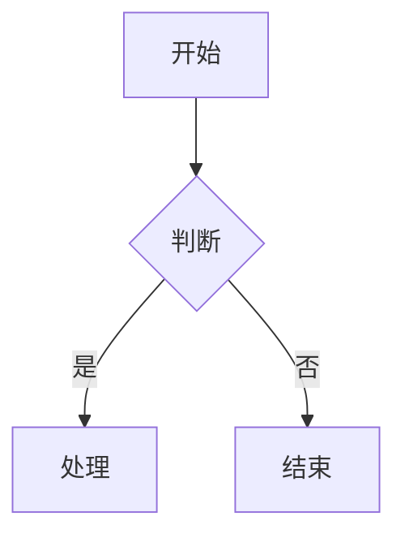
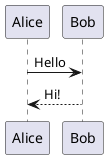

# 飞书扩展 Markdown 语法参考（Lark-flavored Markdown）

以下语法适用于 `feishu docx update`、`feishu docx create` 等所有写入命令。

## 通用规则

- 使用标准 Markdown 语法作为基础
- 使用自定义 XML 标签实现飞书特有功能（具体标签见各功能章节）
- 需要显示特殊字符时使用反斜杠转义：`* ~ ` $ [ ] < > { } | ^`

---

## 📝 基础块类型

### 文本（段落）

```markdown
普通文本段落

段落中的**粗体文字**

多个段落之间用空行分隔。

居中文本 {align="center"}
右对齐文本 {align="right"}
```

**段落对齐**：支持 `{align="left|center|right"}` 语法。可与颜色组合：`{color="blue" align="center"}`

### 标题

飞书支持 9 级标题。H1-H6 使用标准 Markdown 语法，H7-H9 使用 HTML 标签：

```markdown
# 一级标题
## 二级标题
### 三级标题
#### 四级标题
##### 五级标题
###### 六级标题
<h7>七级标题</h7>
<h8>八级标题</h8>
<h9>九级标题</h9>

# 带颜色的标题 {color="blue"}
## 红色标题 {color="red"}
# 居中标题 {align="center"}
## 蓝色居中标题 {color="blue" align="center"}
```

**标题属性**：支持 `{color="颜色名"}` 和 `{align="left|center|right"}` 语法，可组合使用。颜色值：red, orange, yellow, green, blue, purple, gray。

### 列表

有序列表、无序列表嵌套使用 tab 或 2 空格缩进：

```markdown
- 无序项1
  - 无序项1.a
  - 无序项1.b

1. 有序项1
2. 有序项2

- [ ] 待办
- [x] 已完成
```

### 引用块

```markdown
> 这是一段引用
> 可以跨多行

> 引用中支持**加粗**和*斜体*等格式
```

### 代码块

**⚠️** 只支持围栏代码块（` ``` `），不支持缩进代码块。

````markdown
```python
print("Hello")
```
````

支持语言：python, javascript, go, java, sql, json, yaml, shell 等。

### 分割线

```markdown
---
```

---

## 🎨 富文本格式

### 文本样式

`**粗体**` `*斜体*` `~~删除线~~` `` `行内代码` `` `<u>下划线</u>`

### 文字颜色

`<text color="red">红色</text>` 或 `<font color="red">红色</font>` `<text background-color="yellow">黄色背景</text>`

支持: red, orange, yellow, green, blue, purple, gray。`<font>` 是 `<text>` 的别名，两者等效。

### 链接

`[链接文字](https://example.com)` （不支持锚点链接）

### 行内公式（LaTeX）

`$E = mc^2$`（`$`前后需空格）或 `<equation>E = mc^2</equation>`（无限制，推荐）

---

## 🚀 高级块类型

### 高亮块（Callout）

```html
<callout emoji="rocket" background-color="light-green" border-color="green">
支持**格式化**的内容，可包含多个块
</callout>
```

**属性**: emoji (推荐使用文本名称，也支持 unicode 字符自动映射), background-color, border-color, text-color

**背景色**: light-red/red, light-blue/blue, light-green/green, light-yellow/yellow, light-orange/orange, light-purple/purple, pale-gray/light-gray/dark-gray

**常用组合**:

| 场景 | emoji 属性（推荐） | unicode 字符 | background-color |
|------|-----------------|------------|-----------------|
| 提示 | `bulb` | 💡 | `light-blue` |
| 警告 | `warning` | ⚠ | `light-yellow` |
| 危险/错误 | `x` | ❌ | `light-red` |
| 成功/完成 | `white_check_mark` | ✅ | `light-green` |
| 发布/公告 | `rocket` | 🚀 | `light-green` |
| 礼物/新功能 | `gift` | 🎁 | `light-yellow` |
| 禁止 | `red_circle` | 🚫 | `light-red` |
| 快捷提示 | `zap` | ⚡ | `pale-gray` |
| 热门/重要 | `fire` | 🔥 | `light-orange` |
| 备注 | `memo` | 📝 | `pale-gray` |

> **emoji 用法说明**：推荐使用文本名称（如 `warning`、`bulb`）——含义明确且不受编码影响。unicode 字符写法（如 `emoji="💡"`）也受支持，CLI 会自动规范化为对应名称；未在映射表中的 emoji 字符将原样传给 API（可能失败）。

**限制**: callout 子块支持文本、标题、列表、待办、引用。**代码块不直接支持**：写入时会被自动提升到 callout 之后（结果有 warning 提示），建议主动将代码块放在 callout 外侧以控制布局。表格、图片不支持。

### 分栏（Grid）

适合对比、并列展示场景。支持 2-5 列：

#### 两栏（等宽）

```html
<grid cols="2">
<column>

左栏内容

</column>
<column>

右栏内容

</column>
</grid>
```

#### 三栏自定义宽度

```html
<grid cols="3">
<column width="20">左栏(20%)</column>
<column width="60">中栏(60%)</column>
<column width="20">右栏(20%)</column>
</grid>
```

**属性**: `cols`(列数 2-5), `width`(列宽百分比，总和必须为 100)

> **等宽时可省略 `width`**，系统会自动按 `100 / 列数` 平均分配（如 4 列各 25）。混合使用时，未指定 `width` 的列平分剩余空间。

### 表格

#### 标准 Markdown 表格

```markdown
| 列 1 | 列 2 | 列 3 |
|------|------|------|
| 单元格 1 | 单元格 2 | 单元格 3 |
| 单元格 4 | 单元格 5 | 单元格 6 |
```

#### 飞书增强表格

当单元格需要复杂内容（列表、代码块、高亮块等）时使用。

**层级结构**（必须严格遵守）：
```
<lark-table>                    ← 表格容器
  <lark-tr>                     ← 行（直接子元素只能是 lark-tr）
    <lark-td>内容</lark-td>     ← 单元格（直接子元素只能是 lark-td）
    <lark-td>内容</lark-td>     ← 每行的 lark-td 数量必须相同！
  </lark-tr>
</lark-table>
```

**属性**：
- `column-widths`：列宽，逗号分隔像素值，总宽≈730
- `header-row`：首行是否为表头（`"true"` 或 `"false"`）
- `header-column`：首列是否为表头（`"true"` 或 `"false"`）

**单元格写法**：内容前后必须空行

```html
<lark-td>

这里写内容

</lark-td>
```

**完整示例**（2行3列）：

```html
<lark-table column-widths="200,250,280" header-row="true">
<lark-tr>
<lark-td>

**表头1**

</lark-td>
<lark-td>

**表头2**

</lark-td>
<lark-td>

**表头3**

</lark-td>
</lark-tr>
<lark-tr>
<lark-td>

普通文本

</lark-td>
<lark-td>

- 列表项1
- 列表项2

</lark-td>
<lark-td>

代码内容

</lark-td>
</lark-tr>
</lark-table>
```

**限制**：单元格内不支持 Grid 和嵌套表格

**禁止**：
- 混用 Markdown 表格语法（`|---|`）
- 遗漏 `<lark-td>` 标签

### 图片

```html
<image url="https://example.com/image.png" width="800" height="600" align="center" caption="图片描述文字"/>
```

**属性**: url (必需，系统会自动下载并上传), width, height, align (left/center/right), caption

**⚠️ 重要**: 不支持直接使用 `token` 属性（如 `<image token="xxx"/>`），只支持 URL 方式。

支持 PNG/JPG/GIF/WebP/BMP，最大 10MB。

### 文件

```html
<file url="https://example.com/document.pdf" name="文档.pdf" view-type="1"/>
```

**属性**:
- url (文件 URL，必需，系统会自动下载并上传)
- name (文件名，必需)
- view-type (1=卡片视图, 2=预览视图，可选)

**⚠️ 重要**: 不支持直接使用 `token` 属性（如 `<file token="xxx"/>`）

### 视频

```html
<video file="/path/to/demo.mp4" name="产品演示"/>
<video url="https://example.com/demo.mp4"/>
```

**属性**:
- file (本地文件路径) 或 url (远程 URL)，二选一，必需
- name (显示名，可选；若无扩展名会自动从原始文件名补上)

系统自动上传并插入展开的视频卡片（View 块 view_type:2）。支持 mp4、mov 等飞书支持的视频格式。

### 画板（Mermaid / PlantUML 图表）

支持两种图表语法：Mermaid 和 PlantUML。

#### Mermaid 图表

**图表优先选择此格式**。mermaid 图表会被渲染为可视化的画板。

````markdown

````

**支持图表类型**: flowchart, sequenceDiagram, classDiagram, stateDiagram, gantt, mindmap, erDiagram

#### PlantUML 图表

Mermaid 满足不了的场景可以选择 PlantUML 进行绘图。

````markdown

````

**支持图表类型**: sequence, usecase, class, activity, component, state, object, deployment

#### 读取画板

读取时返回 `<whiteboard>` 标签：

```html
<whiteboard token="xxx" align="center" width="800" height="600"/>
```

**重要说明**：
- 使用 Mermaid/PlantUML 代码块，系统自动转换为画板；禁止直接写 `<whiteboard>` 标签
- 读取时只能获取 token，可通过 `feishu fetch <token>` 查看内容。无法获取原始源码

### 多维表格（Bitable）

```html
<bitable view="table"/>
<bitable view="kanban"/>
```

**属性**: view (table/kanban，默认 table)

**注意**: token 是只读属性，创建时不能指定，只能创建空的多维表格，创建后再手动添加数据。

### 会话卡片（ChatCard）

```html
<chat-card id="oc_xxx" align="center"/>
```

**属性**: id (格式 oc_xxx, 必需), align (left/center/right)

### 内嵌网页（Iframe）

```html
<!-- 自动识别：直接粘贴页面 URL，系统自动转换为嵌入链接并推导 type -->
<iframe url="https://www.bilibili.com/video/BV1GJ411x7h7"/>
<iframe url="https://www.ixigua.com/7349488795498701312"/>
<iframe url="https://v.youku.com/v_show/id_XNTg1MzQ0OTYwMA==.html"/>
<iframe url="https://www.figma.com/design/abc123/MyFile"/>
<iframe url="https://codepen.io/user/pen/abcDEF"/>

<!-- 手动指定 type 时跳过自动识别，URL 原样使用 -->
<iframe url="https://player.bilibili.com/player.html?bvid=BV1GJ411x7h7&page=1" type="1"/>
```

**属性**: url (必需), type (组件类型数字, 可选——省略时自动从 URL 推导)

**自动识别的平台**: Bilibili（bilibili.com）、西瓜视频（ixigua.com）、优酷（v.youku.com）、Figma（figma.com）、CodePen（codepen.io）。不匹配时 URL 原样使用。

**type 枚举**: 1=Bilibili, 2=西瓜, 3=优酷, 4=Airtable, 5=百度地图, 6=高德地图, 8=Figma, 9=墨刀, 10=Canva, 11=CodePen, 12=飞书问卷, 13=金数据, 99=Other

### 引用容器（QuoteContainer）

```html
<quote-container>
引用容器内容
</quote-container>
```

与 `>` 引用块不同，引用容器是容器类型，可包含多个子块。

---

## 🔧 高级功能块

### 电子表格（Sheet）

```html
<sheet rows="5" cols="5"/>
<sheet/>
```

**属性**: rows (行数，默认 3，最大 9), cols (列数，默认 3)

**注意**: token 是只读属性，创建时不能指定。只能创建空的电子表格，创建后使用 Sheet API 操作数据。

### 只读块类型 🔒

以下块类型仅支持读取，不支持创建：

| 块类型 | 标签 | 说明 |
|--------|------|------|
| 思维笔记 | `<mindnote token="xxx"/>` | 飞书原生功能，只读，无法通过 CLI 创建或修改。如需在文档中创建思维导图，使用 Mermaid ` ```mindmap ` 代码块（写入后自动转为可编辑画板） |
| 流程图/UML | `<diagram type="1"/>` | type: 1=流程图, 2=UML |
| 链接预览 | `<link-preview url="消息链接" type="message"/>` | 仅消息链接，只读 |
| 任务块 | `<task members="ou_xxx" due="2025-01-01">标题</task>` | members 逗号分隔 |
| AI 模板 | `<ai-template/>` | 无内容占位块 |
| 文档小组件 | `<add-ons component-type-id="blk_xxx" record='{"key":"value"}'/>` | 问答互动等 |
| Jira 问题 | `<jira-issue id="xxx" key="PROJECT-123"/>` | 需 Jira 集成 |
| OKR ⚠️ | `<okr id="okr_xxx"><objective id="obj_1"><kr id="kr_1"/></objective></okr>` | 仅 user_access_token |

### 任务块

```html
<task task-id="xxx" members="ou_123, ou_456" due="2025-01-01">任务标题</task>
```

**属性**: task-id, members (成员 ID 列表), due (截止日期)

### 同步块

```html
<!-- 源同步块：内容在子块中 -->
<source-synced>子块内容...</source-synced>

<!-- 引用同步块：自动获取源文档内容 -->
<reference-synced source-block-id="xxx" source-document-id="yyy"/>
```

**属性**: reference-synced 需要 source-block-id（源 source-synced 标签的 block ID）和 source-document-id（源文档 token）

### 议程（Agenda）

```html
<agenda>
  <agenda-item>
    <agenda-title>议程标题</agenda-title>
    <agenda-content>议程内容</agenda-content>
  </agenda-item>
</agenda>
```

### Wiki 子页面列表（SubPageList）

```html
<sub-page-list wiki="wiki_xxx"/>
```

仅支持知识库文档，需传入当前页面的 wiki token。

---

## 📎 提及和引用

### 提及用户

```html
<mention-user id="ou_xxx"/>
```

**属性**: id (用户 open_id，格式 ou_xxx)

注意不要直接在文档中写 `@张三` 这类格式，应当先获取用户的 id，再使用 `<mention-user>`。

### 提及文档

```html
<mention-doc token="doxcnXXX" type="docx">文档标题</mention-doc>
```

**属性**: token (文档 token), type (docx/sheet/bitable)

---

## 📅 日期和时间

### 日期提醒（Reminder）

```html
<reminder date="2025-12-31T18:00+08:00" notify="true" user-id="ou_xxx"/>
```

**属性**:
- date (必需): `YYYY-MM-DDTHH:mm+HH:MM`, ISO 8601 带时区偏移
- notify (true/false): 是否发送通知
- user-id (必需): 创建者用户 ID

---

## 📐 数学表达式

### 块级公式（LaTeX）

````markdown
$$
\int_{0}^{\infty} e^{-x^2} dx = \frac{\sqrt{\pi}}{2}
$$
````

### 行内公式

```markdown
爱因斯坦方程：$E = mc^2$（注意 $ 前后需空格）
```

---

## ✍️ 写作指南

### 场景速查

| 场景 | 推荐组件 | 说明 |
|------|----------|------|
| 重点提示/警告 | Callout | 蓝色提示、黄色警告、红色危险 |
| 对比/并列展示 | Grid 分栏 | 2-3 列最佳，配合 Callout 更醒目 |
| 数据汇总 | 表格 | 简单用 Markdown，复杂嵌套用 lark-table |
| 步骤说明 | 有序列表 | 可嵌套子步骤 |
| 时间线/版本 | 有序列表 + 加粗日期 | 或用 Mermaid timeline |
| 代码展示 | 代码块 | 标注语言，适当添加注释 |
| 知识卡片 | Callout + emoji | 用于概念解释、小贴士 |
| 引用说明 | 引用块 > | 引用原文、名言 |
| 术语对照 | 两列表格 | 中英文、缩写全称等 |
| 流程/架构图 | Mermaid | flowchart/sequenceDiagram 等 |

---

## 🎯 最佳实践

- **空行分隔**：不同块类型之间用空行分隔
- **转义字符**：特殊字符用 `\` 转义：`\*` `\~` `\``
- **图片**：使用 URL，系统自动下载上传；不支持 token 写入
- **分栏**：列宽总和必须为 100
- **表格选择**：简单数据用 Markdown，复杂嵌套用 `<lark-table>`
- **提及**：@用户用 `<mention-user>`，@文档用 `<mention-doc>`
- **目录**：飞书自动生成，无需手动添加
- **Callout**：子块不支持代码块、表格、图片
